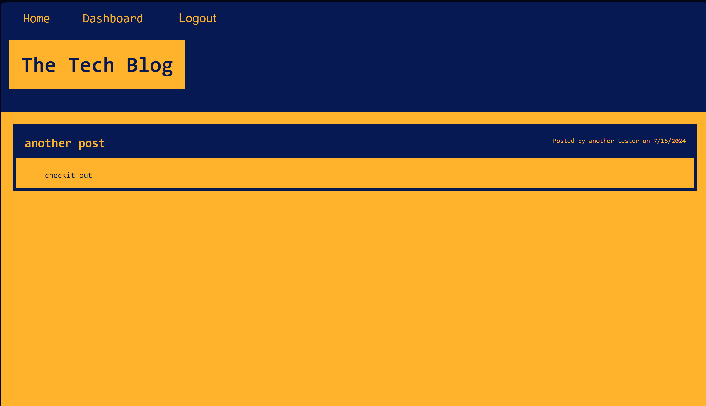
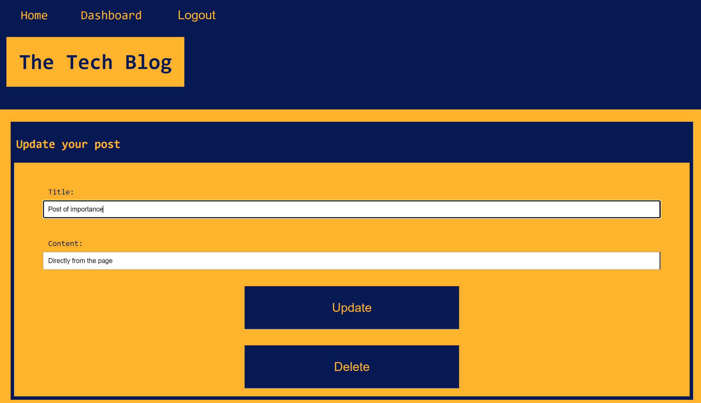

# CMS Tech Blog
  
  ## Description

  This is a CMS-blog called Tech Blog where you can make posts and comments

  Github repository : https://github.com/yordanop/devotion-replace-risen

  Deployed app: https://tech-blog-5znp.onrender.com/

  ## Views of the app

  Blogpost View :
  

  Dashboard View :
  

  Home View :
  

  Login View :
  

  Signup View :
  

  Post to update View :
  
  

  ## Questions

  My email : yordanopv@gmail.com
  
  My Github page : https://github.com/yordanop

  ## Table of Contents

- [Installation](#installation)
- [Usage](#usage)
- [Credits](#credits)
- [License](#license)

## Installation

just enter the deployed app link

## Usage

Create an account, login, you will be presented with all posts made

## Credits
I want to thank and recognize the support from my teammates

## License

   [MIT](https://choosealicense.com/licenses/mit/)

  